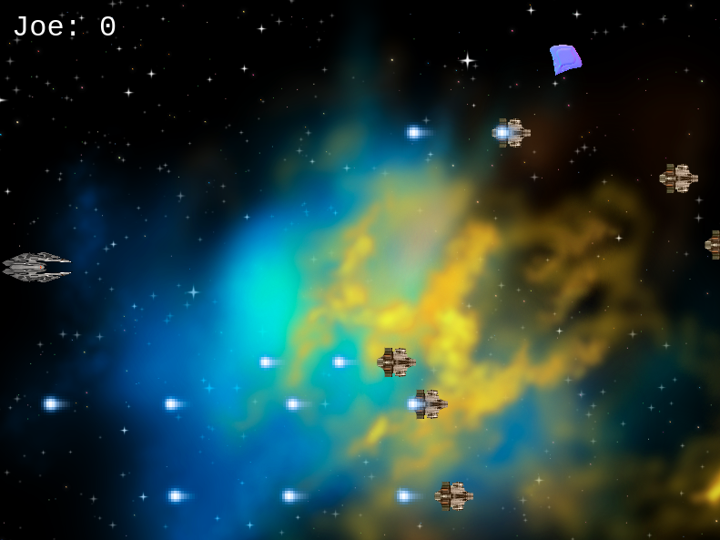
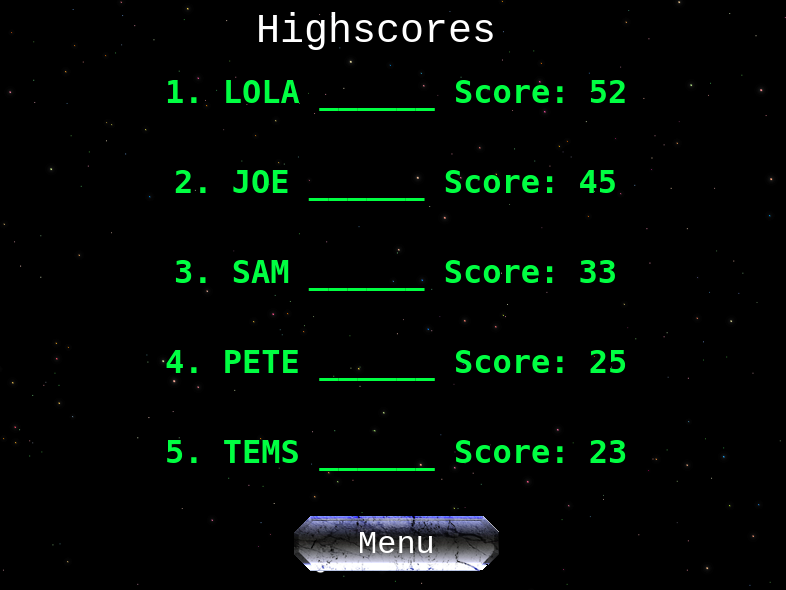

<!-- 

  <!--  -->

  <!-- <h1 align="center">🛸👾 Earth Defender</h1>

<h3 align='center'>
    Space Shooter Game, Made With Javascript, Phaser 3 and Webpack
</h3>

     
    <a href="https://.github.io//"><strong>🕹️ Play The Game »</strong></a>
     
     
    <a href="https://github.com///archive/feature/readme.zip">Download this repository</a>
    |
    <a href="https://github.com///issues/new/choose">Report A Bug</a>
    |
    <a href="https://github.com///fork">Fork It</a>
  

 -->

<!-- ## 📑 Table of Contents
  - [The Project Brief](https://github.com///tree/feature/readme#-the-project-brief)
  - [The Nitty Gritty](https://github.com///tree/feature/readme#%EF%B8%8F-the-nitty-gritty)
  - [Tools & Technology Used](https://github.com///tree/feature/readme#-tools--technology-used)
  - [Setup & Use](https://github.com///tree/feature/readme#-setup--use)
  - [Showcase](https://github.com///tree/feature/readme#-feature-previews)
  - [Contributions, Issues and Forking](https://github.com///tree/feature/readme#%EF%B8%8F-contributions-issues-and-forking)
  - [Creator](https://github.com///tree/feature/readme#-creator)
  - [Show Your Support!](https://github.com///tree/feature/readme#-show-your-support)
  - [Licensing](https://github.com///tree/feature/readme#%EF%B8%8F-licensing) --> -->

## 🔰 The Project Brief

This is the Javascript Capstone Project, to be completed by students of [Microverse](https://www.microverse.org/).

With 5 days to complete the Javascript Capstone project, there's a lot of work to be done - but that's the point. The Javascript Capstone, much like those before it, are meant to test us in more realistic, industry-like situations. We're given a project to tackle, which often includes a new piece of tech and given a tight deadline to adhere to.

In this project, I was tasked with creating a game(space shooting game) in 5 days, using Phaser - a new technology I am just coming across at the beginning of the 5 days. And I am also to fulfil requirements such as, adding scores and a leader board and testing the functionalities(Phaser excluded)

## 🛠️ The Daily Goals of the Project
The Capstone project was broken down into 5 particular days and achieving a particular milestone each day to make the project a reality:

### Day 1 - Learning About the Phaser Javascript Library
On the first day, I learnt about the Phaser library by going through some tutorials. I also created a project template by setting it up to use webpack in order to organize and bundle the code

### Day 2 - Game Design and Assembling Assets
On day 2, I needed to design the game and get assets. All assets for this game are gotten from [OpenGameArt](https://opengameart.org/), a fantastic source for anyone looking for assets for non-commercialised games.

### Day 3 - Game Setup (Basic scene creation, player movement, game boot, etc)
I needed to set up my scenes for the project, following a tutorial and other resources in creating these scenes:
- A boot scene which starts the game
- Preloader Scene which is where I load all my assets
- A title scene which is the main menu where players can choose to start the game, go to the menu options(credits, option or highscore) scene
- Game scene which is where all shootings will be taking place
- Also, I added logic to my game scene to allow my players move

### Day 4 - Enemy Creation and Spawning Enemies
Enemies were introduced here, with different sizes of enemies, speed, shooting speed and weapon size. This is done to make the game difficult.
Both the player and the enemy can shoot each other at this point but seriously I think if I can allow peace to reign between the player and the enemy, I could have made them sign a peace treaty but those guys are hell bent on destroying each other(Not their fault though, I made them___ haha)

### Day 5 - Score System implementation & Finalisation with additional features
There is a point system on every enemy shot(None on the player because he will die and the game will be over).
Enemies are given point based on how difficult they are.
The scores are shown along with the pilot name(Player). 

The scores are sent to a leaderboard API and retrieved to show the leading players in the game

## 🔬 Tools & Technology Used
**Languages & Frameworks**
 - Javascript
 - [Phaser 3.24.1](http://phaser.io/)
 - Webpack 5.4.0

**Package Management**
 - NPM

**Testing**
 - [JEst 26.6.3](https://jestjs.io/)

**Linters & Quality Control**
 - [ESLint](https://eslint.org/)
 - [StyleLint](https://stylelint.io/)

**Deployment**
 - 

### 💻 Setup & Use
Follow [this link]() to see a live version of the project. If you'd like a closer look, continue reading....

#### Setup
For a direct link to the game, [head here.](https://earthdefenders.netlify.app/)

1. To inspect and tinker with the code on your system, download this repo either [here](https://github.com/didymus707/Space-Shooter-With-Phaser3/tree/feature) or from the link at the top of the page

2. Now it's time to ensure you've got Node and NPM installed. If you do, skip this step. Otherwise, head on over to [nodejs's website](https://nodejs.org/en/) to download node with npm.

3. Time to go back to the project! Open your terminal (either in your text editor or otherwise) and 'cd' (i.e. navigate) to the root of this repo.

4. Time to install Webpack! Ensuring you're at this repo's root, enter the following command into your terminal. This will install webpack locally (to this project only):

        npm install --save-dev webpack

5. Finally, once webpack has installed successfully, run the following command to install all of the projects dependencies:

        npm install

#### Code Usage
There are a few commands that you can use interact with the project:
 - `$npm run build` - This will build the project using webpack and bundle everything into the `/dist` folder. From here, you can open the `index.html` in your browser to play the game.

 - `$npm run watch` - This will build and update the project in the `/dist` folder **actively**, meaning changes will update `/dist`. You will, however, have to refresh the browser to see changes.

 - `$npm run start` - This will build and update the project with changes. No browser refresh required. This is appropriate for if you want to edit the games files and have the page update on save.

 - `$npm run test` - This will run all tests for the project with the written Jest tests.

#### Playing the Game ⬆️⬇️⬅️➡️
The game has a very basic control system. Your directional keys
 - Up - Move the ship upwards;
 - Down - Move the ship downwards;
 - Left - Move the ship left;
 - Right - Move the ship right;
 - Spacebar - Fire the lasers!

The objective of the game? Destroy as many of the enemy as possible! The game is set up so that it will progressively get more difficult the more enemies you defeat, so keep at it!

******

## 🎬 Feature Previews

### The Main Game Scene

> A Quick Preview of the In-Game action

### The Post-Match Highscores

> A preview of the Post-game highscore scene, where users can see their scores stack up against those previously attained. All previous highscores are fetched via service API.

*******

## 🛎️ Contributions, Issues and Forking

Contributions, issues and feature requests are more than welcome!

If you have any problems playing the game or setting it up, please submit it as a bug on the [issues page.](https://github.com/didymus707/Space-Shooter-With-Phaser3/tree/feature/readme/issues) right away!

If you want to make your own changes, modifications or improvements, go ahead and Fork it!
1. [Fork it](https://github.com/didymus707/Space-Shooter-With-Phaser3/tree/feature/readme)
2. Create your working branch (git checkout -b [choose-a-name])
3. Commit your changes (git commit -am 'what this commit will fix/add/improve')
4. Push to the branch (git push origin [chosen-name])
5. Create a new Pull Request

## :clap::thumbsup: Acknowledgements
- Jared York's amazing tutorial [here](https://learn.yorkcs.com/)
- [Luis Zino amazing Phaser tutorial series](https://www.youtube.com/user/ricosushi)
- [Opengameart](https://www.opengameart.org)

## 💂🏽💻 Creator

## 🖐🏼 Show Your Support!
Give a ⭐️ if you like this project!
